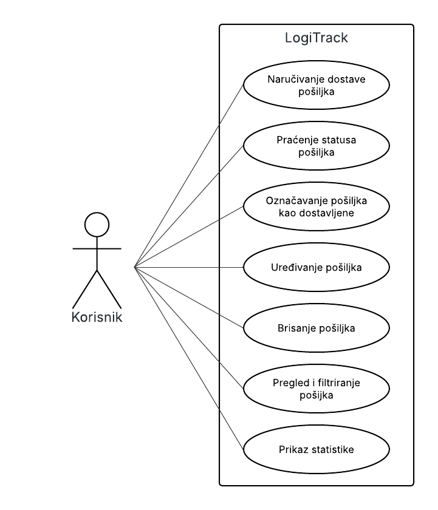

# Logitrack: Projekt Informatički Sustavi

## Opis projekta
Logitrack predstavlja sustav za praćenje i upravljanje pošiljkama. Omogućuje korisnicima kreiranje, uređivanje, praćenje statusa i dostavu pošiljaka. Sustav je osmišljen kako bi olakšao logističke procese i pružio korisnicima intuitivno sučelje za upravljanje pošiljkama.

## Use case


## Funkcionalnosti
- Kreiranje novih pošiljaka
- Uređivanje postojećih pošiljaka
- Praćenje statusa pošiljaka
- Dostava pošiljaka
- Vizualizacija podataka putem grafova
- Prikaz svih pošiljaka u sustavu

## Pokretanje aplikacije

1. Klonirajte repozitorij na svoje računalo:
    ```powershell
    git clone https://github.com/erikfakin/logitrack
    ```

2. Uđite u direktorij projekta:
    ```powershell
    cd logitrack
    ```

3. Postavite virtualno okruženje i aktivirajte ga:
    ```powershell
    docker build -t logitrack .
    docker run -p 5000:5000 logitrack
    ```